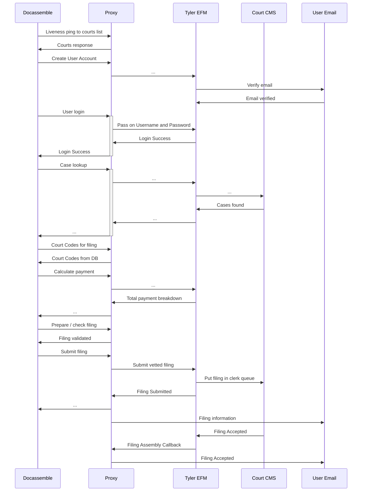

# Architecture

There's a glossary at the end with common e-filing jargon.
If I refer to specific `*.java` files, I will use just the file name (i.e. `LoginDatabase.java`) if it's unique in the repo, or sub number of
subpackages of the file (`db.LoginDatabase.java`) if there are multiple files with the same name.

## ECF Architecture

ECF is the electronic court filing standard, an Oasis standard. We support ECF v4, and ECF v5.

ECF operates with several different Major Design Elements, or MDEs. These are just specific servers that talk to each other. It means that if you
want to search the court, you need to call an API at a different service. The details aren't super important from the EFSP perspective.

These MDEs include:

* the CourtRecordMDE: searching for cases and getting specific case information
* the FilingReviewMDE: where you actually make filings. Also can cancel filings, and get the status of specific filings
* the ServiceMDE: what you call to serve other parties in the case
* the FilingAssemblyMDE: this is the EFSP itself! It has to be able to accept incoming traffic from the EFM about the status of specific filings (if they are accepted, rejected, etc.)
* (ECF 5 only) CourtSchedulingMDE: lets you schedule court events, like Return dates, etc.
* (ECF 5 only) CourtPolicyMDE: gets specific information about each court, which you will need to make filings into with the FilingReviewMDE. In ECF 4, these API calls were a part of the FilingReviewMDE.

Notably, ECF only lays out what APIs you should call, and how to structure the information you pass to those APIs (i.e. they're parameters). It doesn't tell you what bits of information that you
need to provide. It does describe genericodes, which are a way for the EFM to tell the EFSP what values it accepts in particular XML element. However, certain values will always vary between implementations of EFMs. For example, Tyler Technologies makes you create Attorneys as a part of your firm before you can add them to cases. They have their own bespoke API for creating Attorneys, and through that API, give you a unique ID for those attorneys. The unique attorney ID is what you provide as the ID in the attorney part of a filing.

Hopefully this document is enough, and you should only have to refer to the standards when trying to discern what's different about ECF vs Tyler.

* [the ECF v4 standard](https://docs.oasis-open.org/legalxml-courtfiling/specs/ecf/v4.01/ecf-v4.01-spec/ecf-v4.01-spec.html)
* [the ECF v5 standard](https://docs.oasis-open.org/legalxml-courtfiling/ecf/v5.0/ecf-v5.0.html)

## Package layout

Java organizes its code by folders, called packages. It's encouraged to put your code in a package pertaining to the organization that is making the code, so all of our application code is in `edu.suffolk.litlab.efspserver`. Autogenerated code from the XML schemas and WSDLs end up in their namespaces, i.e. `urn:tyler:ecf:extensions:FilingServiceResponseMessage` will end up in `tyler.ecf.extensions`.

Code that is directly in the `edu.suffolk.litlab.efspserver` package (i.e. not in a subpackage) is code that is common to all of the other packages. This includes many plain-old-java-objects (POJOs) that contain information we ingest directly, and use as a common format before making filings to specific courts, to utility classes like `RandomString.java` and `StdLib.java`.

The `db` subpackage contains code that handles and is used to access the databases, including the Tyler codes database, `tyler_efm_codes`.

The `docassemble` subpackage contains code that reads in filing data from the docassemble platform, culminating in putting all of it in the `FilingInformation` object.

The `ecf4` subpackage contains all of the code used to file into ECF 4 courts. The `jeffnet` subpackage does the same for the Jefferson Parish court in Louisiana.

The `ecfcodes` subpackage extends on the `db` subpackage, and contains lots of specific code to handle reading and writing codes to the database.

The `services` subpackage contains all of the Jakarta API for RESTful Web Services (JAX-RS) code that provides our external facing REST API, and utility files that are JAX-RS and REST specific.

The `tyler` subpackage contains code specific to Tyler Technologies' implementations of ECF 4 and ECF 5.

### The Autogenerated code

You will have to use the Autogenerated code a lot when working with the SOAP APIs. There are three sources to these codes:

* NIEM (`gov.niem.*`), a federal standard from the US government for passing around data between different agencies
* ECF (`oasis.names.*` for ECF4 and `https.docs.oasis_open_org.legalxml_courtfiling.ns.*` for ECF5)
* Various other standards that ECF includes as a part of itself, including
    * `ietf.params.xml.ns.icalendar_2.*`
    * `un.unece.uncefact.*`
    * `org.oasis_open.docs.codelist.ns.genericode.*`
    * `w3._2000._09.xmldsig_`
* Tyler's extensions on ECF (`tyler.ecf.*` for the datatypes, and `tyler.efm` for the APIs themselves)

Each terminal subpackage usually has an `ObjectFactory.java` class. You will often need to this class to create the proper XML wrappers around the Java objects so the SOAP / XML stuff understands the type correctly.
You will need to include multiple ObjectFactory classes in the same file often, so you will need to refer to the full package namespace.

Finally, I recommend learning enough about [the XML Schema](https://www.w3.org/XML/Schema#dev), and directly reading the schema files in `src/main/resources/wsdl/[stage,prod]/*.xsd`.
They are more rigorously defined than the Java classes, and it's easier to look up what types should be used, instead of the Java code just saying `Object`.

## The Databases

There are two distinct databases that we use; both are in Postgres. They are `tyler_efm_codes`, and `user_transactions`.

`tyler_efm_codes` contains all of the genericode data that Tyler makes available from every court in each jurisdiction.
It is the more widely used of the databases. There is a Quartz job (setup in `ecf4.TylerModuleSetup.java`) that runs around 2 AM every night, pulling new codes from the courts and updating the databases and their indices. More details about the structures of the codes can be found in [tyler_codes.md](tyler_codes.md).

`user_transactions` is everything else. As of writing, it has 4 tables: `at_rest_keys`, `message_settings`, `schema_version`, and `submitted_filings`.
* `at_rest_keys` is the authorization database for server API keys. It contains the name and id of the server, whether it has access to tyler and Jeffnet functionalities, and when it was created.
  It also contains a SHA-256 hash of the API key, keeping the real key secure from leaks, and letting us confirm servers' API keys
* `message_settings` contains default email settings for a particular server. It lets you set the email subject line and template and for the confirmation and accept/reject email.
  NOTE: this db isn't heavily used, likely because there isn't an easy API to access it, and it isn't as flexible as being able to set unique emails for each interview.
  You should use `accepted_msg_template` et al. in the `submitted_filings` table instead.
* `schema_version` is a single row, single column table, than contains the current version of the database.
  This lets us seamlessly add, alter, and remove rows from any of the tables in `users_transactions` or `tyler_efm_codes` by incrementing the schema version.
  The code that handles this is in `db.DatabaseVersion.java`.
* `submitted_filings` is the only table with user provided data.
  It contains PII about the user, including their user ID for the EFM service, their name, phone, and email (for contacting them about their filing).
  It also contains information about the filing itself like the case title, envelope id, when it was submitted, the court, from what server, etc.
  Finally, it has `accepted_msg_template`, `accepted_msg_subject`, and the same for `rejected_msg_*`, and `neutral_msg_*`. 
  These values are the full email subject lines and templates that we should send out to the user when they get a response from the court clerk, depending on the clerk's categorization of the filing.
  `neutral` is any status that isn't explicitly "Accepted" or "Rejected".

## The Network call mapping

Below is the rough outline of what calls where when in our architecture. Not all network calls are present, but this is the general gist.

## Making a Filing: the largest call

Rough outline: goes to the FilingReviewService, which delegates to the specific jurisdiction. Most jurisdictions are Tyler ECF4, which is `Ecf4Filer.java`. There, the same code is used if something is being checked (an extra API that we make to ensure that the Docassemble interview making the filing is structured well, without hitting the Tyler API, which gives poor error messages), filed, or served. The steps are:

1. get any existing information, either from the API call itself, or from previous cases (with the CourtRecordMDE)
2. piece together the ECF4 Filing message using the `EcfCaseTypeFactory`. For smaller pieces of ECF specific datatypes, we call the `EcfCourtSPecificSerializer`, and for each piece of information, there is a call to `tyler.TylerCodesSerializer` (used by both code in ECF4 and ECF5) that ensure that the semantics of what we pass in are correct according to the many checks and validations that Tyler makes use do, per court.
    * if anything is missing, wrong, or doesn't validate according to Tyler, we return detailed information about what pieces of information were missing, wrong, or optionally could be included. Ideally the docassemble side could dynamically gather additional information, but that hasn't been implemented yet.
    * if everything necessary is present, we make the Filing with the FilingReviewMDE. We get the following:
        * the case ID
        * the envelope ID (the thing we just sent to Tyler, can contain multiple filings)
        * the filing IDs
        * the lead contact of filings
        * the case title
        * the case category
        * the name of the court
3. After we make the filing, we save enough of the filing information (user email, envelope ID from Tyler, etc.) such that when our FilingAssembleMDE gets the callback from Tyler's system, we can properly notify the user. These notifications can be a default, set per server making the filing, or can be a part of the filing API call data itself; the positive, negative, and neutral email templates. The templates can include these variables:
    * `name`: the name of the user
    * `court_name`: the name of the Court
    * `case_type`: the name of the case type, like Divorce, or Small Claims (< $10,000)
    * `transaction_id`: our Id of the users transaction. Not normally necessary
    * `case_title`: the title of the case, like "Smith v Brown"
  Only on the confirmation email
    * `envelope_id`
  Only on the rejected / accepted email:
    * `status`: the status of the filing: an enum that we get from Tyler
    * `message_text`: the message that the clerk sends with the status, if any
    * `message_url`: a URL that the clerk can also send

## Glossary

* Jurisdiction: a legal unit of an independent court system. I.e. Texas is a jurisdiction, as well as Massachusetts. Although not currently present, states with multiple EFMs would be considered two different jurisdictions
* Location: mostly used to refer to a specific court or court-like entity in a jurisdiction. I.e. in Illinois, `adams` is the Adams county court system, and all filings would go to the `adams` location.
* TOGA: Tyler Online GAteway: Tyler's service that handles payments. It's what we have to send users to to enter their credit card and bank information.
* Envelope: a collection of one or more filings, what we actually submit to Tyler when we send e-filings
* ECF: Electronic Court Filing, the standard that we use to communicate with courts
* EFSP: Electronic Filing Service Provider: us / this piece of software. We provide the service directly to the end user, as opposed to the EFM
* EFM: Electronic Filing Manager: the piece of the architecture that sits between the EFSPs and the Courts. Tyler Technologies makes ours.
* CMS: Case Management System: The piece of software that courts use to manage cases. We don't directly communicate with the court CMSs, but we do generally need to know how they work
* MDE: Major Design Element: a component in ECF that serves a specific purpose, and hosts a number of APIs
* WSDL: Web service design language: a type of file in SOAP that describes an endpoint
* SOAP: Simple Object Access Protocol: the standard that we use to communicate with Tyler. Sends XML files back and forth, and those XML files are heavily pre-determined by a heavy API schema, contained in WSDLs
* XML: eXtensible Markup Language: a way of storing data in a structured way. Used in SOAP.
* XSD: XML Schema document, the file format that most of the info about the SOAP API is stored in
* JSON: JavaScript Object Notation: another way of storting data in a structured way. Much easier to read and edit by hand, and more flexible.
* REST: REpresentational State Transfer: a way of interacting with other servers over the internet
* JAX-RS: Jakarta API for RESTful Web Services: a java library / framework that lets us set up an external facing REST API. Uses a lot of annotations.

