# EFSP Operations Manual

## Overview

EFSP (Electronic Filing Service Provider) is a proxy between clients such as DocAssemble and an [ECF 4.0 (LegalXML's Electronic Court Filing 4.0 standard)](https://docs.oasis-open.org/legalxml-courtfiling/specs/ecf/v4.0/ecf-v4.0-spec/ecf-v4.0-spec.html) EFM (Electronic Filing Manager), such as [Tyler Technology's Odyssey](https://www.tylertech.com/products/enterprise-justice/enterprise-case-manager). The EFSP is commonly used to create court filings. This application (EfileProxyServer) fulfills the EFSP role and when EFSP is mentioned in this document, you can assume it is referring to this application.

## Design Approach

Try to keep code changes minimal. Keep backwards-compatibility and allow new features to be controlled by additional environment variables. When possible, allow the features to be used beyond just the platform/database stack (Fly.io/Supabase) we're using.

## Staging/Production

There are two environments for EFSP. The staging environment is safe to test against and is configured to communicate w/ the staging Tyler EFM. Care should be taken as emails & SMS messages are still sent. This should be fine as long as you're testing with your own contact information. The production environment is shared between many DocAssemble servers. In the future, this may be partitioned into jurisdictions for scalability and isolation.

## Comparison to Previous Setup on AWS Lightsail

The previous staging & production environments ran in AWS Lightsail. EFSP ran as a dockerized application on a 4GB Ubuntu instance. Docker Compose was used to manage the setup. The Java application and Postgres database server were managed through Docker Compose and both ran within the same instance.

Most operational tasks were performed by SSH'ing into the machine and executing commands in the CLI (Command-Line Interface). The source code was installed and updated on the machine directly using Git. Logs were stored directly in the local filesystem, with API access through the EFSP application to provide visibility to clients who did not have SSH access.

Data is stored within two separate databases: user_transactions and tyler_efm_codes. The tyler_efm_codes database can be rebuilt from scratch. The user_transactions database contains critical state and needs to be preserved.

The Quartz Scheduler is embedded to run Tyler Code updates on a daily schedule at around 2:15 am (server time, default ET for BOS). The scheduler is not clustered and in-memory. However, it is relatively safe for multiple updates to be running in separate processes, as the database will sort out the locking/blocking and the tyler_efm_codes database will be updated correctly regardless.

SSL/TLS is handled by Let's Encrypt. However, the certificate renewal is currently a manual process that involves a bit of downtime. 

## Fly.io Stack

The updated stack uses Fly.io, Supabase, Papertrail, and Cloudflare.

* Fly.io runs the dockerized EFSP application.
* Supabase is the Postgres database.
* Papertrail serves as the cloud-hosted log management system, making it easy to aggregate, manage, and share logs.
* Cloudflare provides SSL/TLS encryption and DNS. (TODO: are we planning to use the DDoS protection?)

The overall goal is to make it easier to run and operate EFSP as a service, with the tradeoff being a small monthly cost. Web interfaces are favored over the CLI (Command-Line Interface), although there is still lots of CLI and all existing commands are supported. Ideally, the learning curve will be shortened and day-to-day operational tasks can be done without needing to use the CLI.

The current setup keeps a single machine running at all times within the Boston region. Because Fly.io, Supabase, Papertrail, and Cloudflare are all cloud services, scaling up and out is pretty easy. The trade-off is one of increased cost as more scale is requested. Fly.io also supports auto-scaling. Given the current volume, scaling was not explored and we opted for the simplest conceptual model of a single, continuously instance of the application.

The EFSP application itself is mostly clusterable, the exceptions being:
* the way the Tyler EFM Code Updates are scheduled right now
* CourtPolicy data, which is currently cached in memory (see l. 21 in /src/main/java/edu/suffolk/litlab/efspserver/ecf4/PolicyCacher.java [https://github.com/SuffolkLITLab/EfileProxyServer/blob/a67c75a6690e9bd54fd4050d0c274feccf13b382/src/main/java/edu/suffolk/litlab/efspserver/ecf4/PolicyCacher.java#L12]). To honor Tyler's restriction to only hit the endpoint once per day, this cache will need to be updated so that it can be shared across all instances. Caching it in the database would be one option to achieve that.  

For a single, always running instance, nothing needs to be done.

In a scale-out scenario, the simplest approach of disabling the updates is supported. All EFSP instances within the same environment use the same shared database, so the single updater will result in every instance seeing the latest EFM codes. Alternatively, the Quartz scheduler can be swapped over to store scheduling data in the database and configured for clustered operation.

## Secrets/Configuration

All the supported variables are enumerated in the env.example file. Most of these are the same between the Lightsail and Fly.io setups. There are new variables for Papertrail and to configure the Quartz Scheduler. Details are in the env.example file.

You should have separate .env files for each environment. For example, staging values would be stored in a .env.staging and production values in .env.production.

## Secured Files/Certs

For files that you want to keep out of the Docker image, you should set up a private Fly.io Tigris bucket. This is Fly.io's equivalent of AWS's S3 service. When a Fly.io machine starts up, the fly_startup_script.sh will run. The script will pull down the keystore cert from Tigris if the file is not already in the system. While Fly.io will automatically inject the AWS config values into your application the first time you setup Tigris, you should also store the AWS config values in your .env file in case you need to reference them again or re-create a Fly.io app in the future.

For more details, check out:
https://fly.io/docs/reference/tigris/

## First Time Fly.io Setup

This section covers the steps for spinning up a brand-new Fly.io app.

### Pre-requisites

You should already have the following:
* An .env file with the secrets and environment configuration appropriate for the new app. The docs will refer to this as .env.fly but you can name it whatever makes sense and substitute the name when you see it in the example commands.
* A Fly.io account
* [flyctl](https://fly.io/docs/flyctl/), the Fly.io CLI tools, installed

#### Create the new app

You will need to create the app before deploying. Since the fly.toml already exists, you will want to create the app without generating a new one. To create the app, you will need an app name and Fly.io organization. The example commands will reference efsp-staging and the suffolk-lit-lab organization, but you should substitute your own values there. You can use the same app name, but the Fly.io organization will likely be different.

Create the app by running:
```
fly app create efsp-staging --org suffolk-lit-lab
```

You should see a message saying:
```
New app created: efsp-staging
```

Next, configure the app with your .env values. You should have already copied the env.example file as .env.fly and edited the values in it to match your environment.
```
cat .env.fly | fly secrets import --app efsp-staging --stage
```

The stage option is used so that the values are set but the application won't redeploy until the next step.

Now deploy the application by running:
```
fly deploy --config fly.toml --app efsp-staging
```
You can omit the --app parameter if you're using the app name defined within the fly.toml. You can also omit the --config parameter if you're using the default fly.toml file (as opposed to fly.production.toml, for example). The shortened version in that case would be:
```
fly deploy
```

This step will take some time as Fly.io verifies the configuration and builds the cloud virtual machines using a cloud-based Docker system. After the build is complete, Fly.io will push the image to its registry, whose name should start with registry.fly.io.

If all goes well, your app will be running. Your app should be reached by https on a Fly.io domain name. This value will look something like https://{your-app-name}.fly.dev/ and should be in the output.

Finally, you can set the scale to limit the number of machines created to 1. This step is optional. By default, Fly.io will create 2 machines for high availability. Setting it to 1 makes for a simpler and slightly cheaper setup, but with tradeoffs in performance and availability. To see more in-depth discussion on the tradeoffs, go to the "Scaling Up Fly.io" section. 
```
fly scale --app efsp-staging count app=1
```


## Deploying Code Updates

### Manual Deployment

The process for manual deployment is very similar to the non-Fly.io steps.

First, update the code on your local to the latest:
```
git fetch --all
git pull origin main
```

Then run:
```
fly deploy -c {MY_FLY.TOML}
```
Where the {MY_FLY.TOML} value is the fly.toml config file for the environment you are deploying to. If you don't pass a -c option, the default fly.toml file will be used. For EFSP, this is the staging environment. The production config file is fly.production.toml.

To deploy to production:
```
fly deploy -c fly.production.toml
```

One thing to keep in mind is that the manual deployment builds the Docker image from the contents of your local filesystem. This is crucial for .pfx certificate files, as they are git-ignored but not docker-ignored to allow for the normal local testing. The automatic continuous deployment is a bit safer if you do not want to bake certs into your docker image since that will build from the contents in GitHub, which already has gone through the git ignore filtering step. 

### Automatic Continuous Deployment

If you have forked the EFSP repo, you can set up auto-deploy. Fly.io can be deployed to from a GitHub workflow. For more information on how you would do this, check out:
https://fly.io/docs/app-guides/continuous-deployment-with-github-actions/

There is an example fly.yml file called fly.yml.example. You can use this as a template for your .github/workflows/fly.yml. 

## Viewing Logs

You can view the logs directly on Fly.io. The application logs are also shipped over to Papertrail, which will be covered in more detail. Papertrail is the recommended interface to view logs because it has search, filtering, and aggregation capabilities. However, checking on Fly.io is helpful if you are troubleshooting, as you will be able to see the platform logs in additional to the applications logs. Plus, even if there is an error preventing the application from sending logs to Papertrail, the information will be stored within Fly.io's logs.

### Viewing Logs with Fly.io

To view the logs within Fly.io, click on "Live Logs" in the side menu.

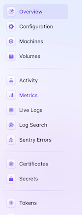

You should now see a web view displaying the live logs.

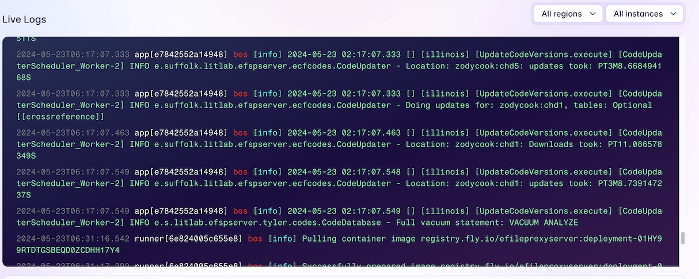

For more information on viewing metrics and logs on Fly.io, check out:
https://fly.io/docs/metrics-and-logs/


### Papertrail

You can read this overview of the log viewer to familiarize yourself with Papertrail:
https://www.papertrail.com/help/event-viewer/

### Papertrail Configuration

The Papertrail system documented here has already been configured. If you do not have access to this Papertrail account, you will need to set up your own account on the service. Please refer to the Papertrail documentation for more information:
https://www.papertrail.com/help/papertrail-documentation/

#### Groups

Groups were set up for each environment (dev, staging, and prod). Dev is used for local machines and other testing.

#### Log Destinations

The EFSP app is configured in logback to send logs to Papertrail via the TLS Syslog method. This uses TCP(TLS) sent to a specific host and port, which is displayed in the log destination page after you set that up.

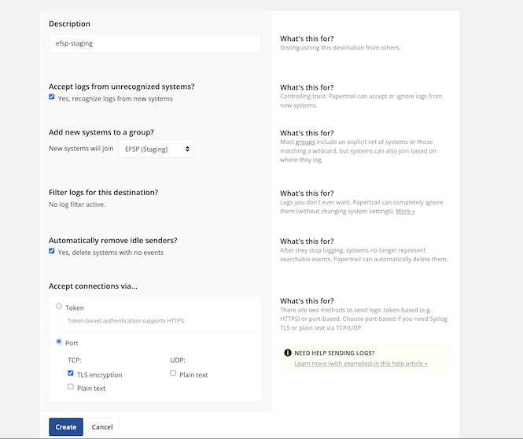

For more details, check out:
https://www.papertrail.com/help/log-destinations/

#### Dashboard

After you log into Papertrail, you will see the dashboard page. The list of groups and systems are displayed here.
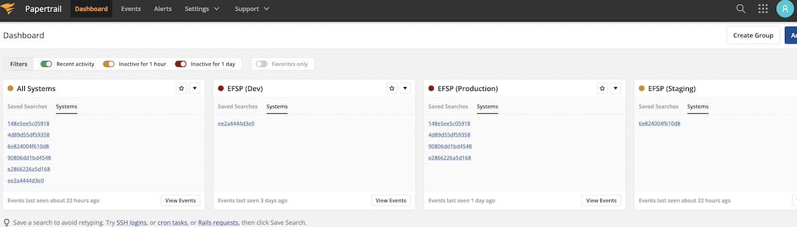

### Viewing Logs

Click on "Events" in the top menu to go to the log viewer. You will probably spend most of your time in the log viewer. The middle of the page displays the logs. At the bottom of the page, you can adjust the filtering and search criteria.

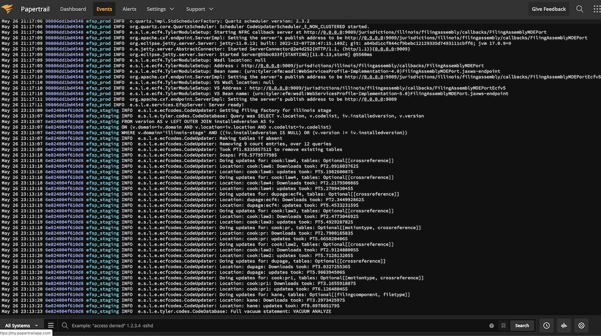

You can type in words to search for in the search box. For example, here the search term "Started" is used to search for only the log messages associated with the application being started:
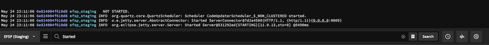

You can choose to only see the logs for a specific group (e.g. staging, prod) by adjusting the group selector at the left-hand side.
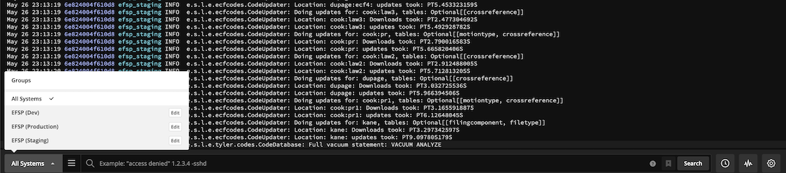

The search box also supports more advanced syntax. For more details, check out:
https://www.papertrail.com/help/search-syntax/

### Alerts

You can configure Papertrail to send alerts when it sees certain patterns in the logs. For more details, check out:
https://www.papertrail.com/help/alerts/

### Scaling Up Fly.io

You can scale up the # of machines if you reach a point where there is a lot of load, want to improve global response times, or want to take advantage of more advanced deployment strategies. The only caveat is that the Tyler EFM Code Updater, which runs on a schedule by default, can get into a conflict if there are multiple instances doing the update at the same time. Since the Quartz Scheduler is running in-memory by default and the schedule is fixed in the code, it is safest to disable the automated updates on any supplemental machines. See env.example for more details on how to do that. 

The default Fly config for EFSP will keep just a single machine running at all times. This is important as the code update will only happen if an instance is active when the schedule hits (2:15 am on the machine's clock).

You can set the # of instances to scale to with the following command:
```
fly scale count app={NUMBER_OF_INSTANCES}
```
where NUMBER_OF_INSTANCES is 1 or higher. For setting it to 1 makes for the simplest setup. You can also leave it with the default 2 to take advantage of Fly.io's rolling deployment strategy. Auto-stop is enabled, so as long as there isn't traffic hitting the machine during the scheduled code update, you will not need to worry about concurrency issues even with multiple machine instances configured.

For more details on deployment, check out:
https://fly.io/docs/apps/deploy/

Generally speaking, you will want to have pre-created machines that are stopped. This optimizes the cold start time, although it will still be relatively slow since EFSP is a Java application. Expect a pre-created machine's cold start to take about 5 seconds. Creating a new machine will be an order or two of magnitude longer. Pre-created machines that are stopped cost very little as you are only billed for the storage space. The cost is negligible compared to the cost of a running machine.

Properly scaling EFSP using Fly.io is an advanced topic beyond the scope of this guide. You should have a good understanding of Fly.io's architecture before attempting this. Here are some good reference links to start from:
* https://fly.io/docs/apps/scale-machine/#scale-vm-memory-and-cpu-with-flyctl
* https://fly.io/docs/flyctl/scale/
* https://fly.io/docs/reference/autoscaling/#main-content-start
* https://fly.io/docs/apps/autostart-stop/


### Viewing Metrics for Your Fly.io Application

Fly.io collects metrics such as memory usage, CPU utilization, etc. To view your metrics, go to the dashboard. Select "Metrics" from the side menu on the left.


You will now see Fly.io's managed Grafana page. This gathers together the metrics collected from your application and provides easy to understand visualizations.

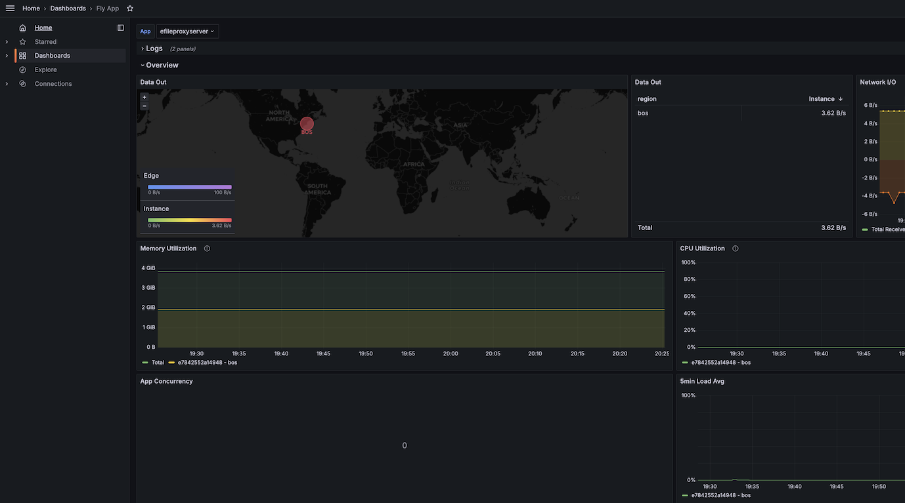

To learn more about Fly.io metrics, check out:
https://fly.io/docs/metrics-and-logs/metrics/#dashboards

To learn more about Grafana, check out:
* https://grafana.com/docs/grafana/latest/dashboards/
* https://grafana.com/docs/grafana/latest/panels-visualizations/visualizations/

### Generating a New API Key

Run the fly_create_api_key.sh script to generate a new API key. The generated key will grant API access to your EFSP instance. The API key is printed to the console output and can be copied from there. Best practice is to give each user of your EFSP instance their own API key.

To create an API key for the app specified in your fly.toml, run:
```
./fly_create_api_key.sh
```

If you want to create a production key, run:
```
./fly_create_prod_api_key.sh
```

Both scripts are the same except for the Fly.io config file passed to the command. You can also create more copies for any of your environments, or alter the script to take in the app or config name. Two different script files are used to make it easier and more obvious for the user running the command. 

The script uses Fly.io commands to spin up an ephemeral machine that will run the Java code to generate the API. This method leverages Fly.io as the authorization mechanism and keeps the permission to generate new API keys to the set of authorized users. An ephemeral machine is used so that key generation does not impact the API performance.  

### SSH Console access

Fly.io offers a Fly command that is akin to connecting to a Lightsail instance using SSH. This is handy if you need to troubleshoot the machine. Unlike SSH, you won't need to set up any keypairs. Instead, your Fly.io login will be all that is needed to authenticate you. To SSH to a Fly.io machine, use the following command:
```
fly ssh console
```

### Setting Secrets/Configuration in Fly.io

You can view the names of the variables that are set with the following command:
fly secrets list

Note that this will not show the values, but it does display both the digest and creation date for the value.

The recommended way to set secrets in Fly.io is to edit them in a .env file. The name .env.fly is assumed for the remainder of these instructions. Note that .env files are excluded from Git. This is important as you should never commit secrets into the repository.

After you edit your .env.fly file and set the appropriate values, you can use the following command to update the Fly.io secrets:
```
cat .env.fly | fly secrets import
```

This will sync the value of every variable in the .env.fly to Fly.io. Note that this will not unset/touch any secrets whose names are not in the .env.fly file.

You can manually set a single secret with the following command:
```
fly secrets set [name] [value]
```

To unset a value, use the following command:
```
fly secrets unset [name]
```

### Supabase Customizations

The "Enforce SSL on incoming connections" is set to true. Since Fly.io and Supabase are not within the same location, this setting ensures that traffic between the two is secured.
For security purposes, the pg_graphql extension is disabled and API access as RLS (Role-Level Security) is not set up for EFSP databases. If possible, you should also restrict network access to an inclusion list.

### Backing Up the Database

The Supabase Postgres database is automatically backed up on a daily basis.

### Restoring a Database Backup
Go the Database -> [Platform] Backups. You will see a list of all the available backups. Click on the "Restore" button. This will bring up the confirmation dialog. Select "Confirm Restore" to restore the backup.

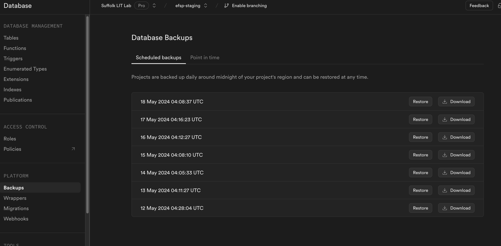

### Viewing Data in the Database

You can view database in the Postgres database through Supabase's web interface. Go to the Table Editor.
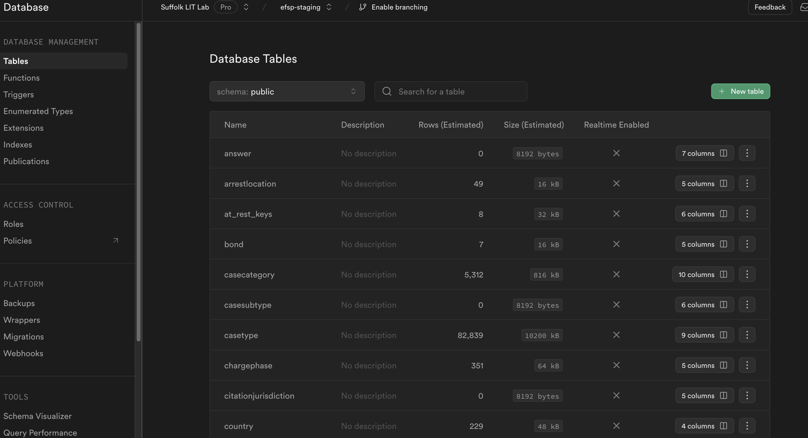

Here you can see all the tables within the "postgres" database. Database in this context refers to the database within Postgres's database/schema/table concept, not as the generic term. The web view can only show tables within the "postgres" database. For the EFSP Fly.io setup, both POSTGRES_CODES_DB and POSTGRES_USER_DB are set to "postgres" so that the data is surfaced within Supabase's interface. Future development work could allow the schema to be configurable, in which case the data could be organized into two different schemas, both of which are accessible in the web interface. In Lightsail, two different databases were used:  tyler_efm_codes and user_transactions, respectively. You can also configure your .env.fly to use those databases. This will work fine on the application side, but you will lose visibility in the web interface.

### Connecting to Supabase with Your Own Database Tools

You can also use your own database tools, such as [PgAdmin](https://www.pgadmin.org/) or psql, to interact with the data in your Supabase database. To get the information for the connection string, go to "Project Settings", then click on "Database" under the "Configuration" section. You should now see a page with the connection string on the right.

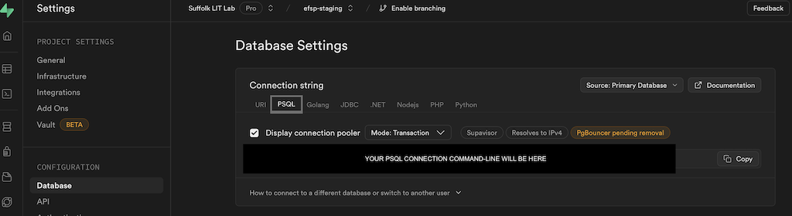

One example use case is migrating data from your existing Docker setup to Supabase. You can use pg_dump with the data only option to export the data from the user_transactions database in Docker, then use psql to import the data into Supabase's postgres database.

For more details about connecting to Supabase with your own database tools, check out:
https://supabase.com/docs/guides/database/connecting-to-postgres#direct-connections
