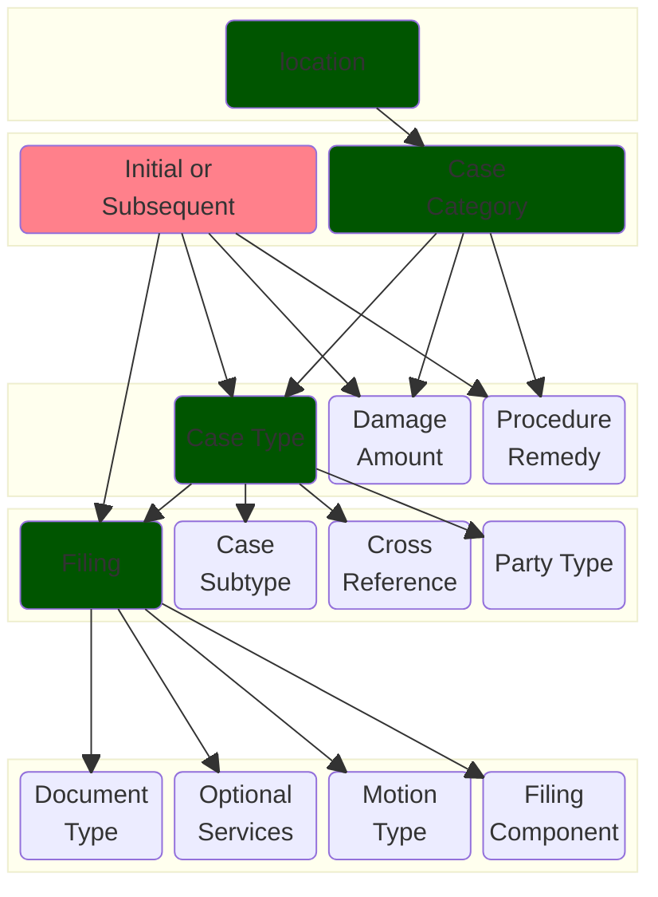

# Tyler EFM Codes

Author: Bryce Willey

TODO(brycew): Still in progress!

Tyler codes are options that the end-user must make (either implicitly or explicitly) when making a filing. The choices are a drop-down list of options, defined by the court and other choices they have made so far in the filing process. Each court decides which codes are available to its filers, and every court differs.

We store all code information in SQL tables internally.

This is not meant to be an exhaustive description of each column in all of the codes: it is an introduction into the hierarchy of the code tables, with a brief description of each.

The hierarchy is shown in the below diagram:

* The <span style="color:005500">green nodes</span> are parent nodes: you need to know its exact code before you can select its dependents.
* The <span style="color:ff808b">pink node</span> isn't a code, but a piece of information about the filing needed to select the correct value if its dependents.




For example, if you want to know what party type codes are allowed to be used in a case, you need to know the following information (all of the parents above the `party type` node):
* the location (i.e. the court)
* the case category
* whether the filing is an initial filing into a new case, or a subsequent filing into an existing case
* the case type

The rough SQL queries for the above would look like this (simplified);

```SQL
SELECT * FROM casecategory where location='adams';
...
SELECT * FROM casetype WHERE location='adams' AND casecategory='1234' AND initial='true';
...
SELECT * FROM partytype WHERE location='adams' AND casetype='5678';
```

The codes system has 45 different codes:
* answer
* arrestlocation
* bond
* casecategory
* casesubtype
* casetype
* chargephase
* citationjurisdiction
* country
* crossreference
* damageamount
* datafieldconfig
* degree
* disclaimerrequirement
* documenttype
* driverlicensetype
* error
* ethnicity
* eyecolor
* filertype
* filetype
* filing
* filingcomponent
* filingstatus
* generaloffense
* haircolor
* language
* lawenforcementunit
* location
* motiontype
* namesuffix
* optionalservices
* partytype
* physicalfeature
* procedureremedy
* question
* race
* servicetype
* state
* statute
* statutetype
* vehiclecolor
* vehiclemake
* vehicletype
* version

Many of these codes are applicable for criminal cases only, and aren't used in our system (see #todo). These are:
* answer: QuestionAnswer in ReviewFiling
* arrestlocation
* bond: relates to CaseChargeBondAmount, CaseChargeBondType, and BondTypeText in ReviewFiling
* chargephase: in ReviewFiling Criminal
* citationjurisdiction
* degree: statutelevelchange
* ethnicity
* eyecolor
* general offense
* haircolor
* lawenforcementunit: EnforcementOfficialText
* physicalfeature: personphysicalfeature, and physicalfeature: vehicletype, i.e. Four Door, 34 PU, Moped, etc.
* question: QuestionAnswer in ReviewFiling
* race: PersonRaceText in ReviewFiling
* statute
* statuetypes, a whole lot, lol
* vehiclecolor
* vehiclemake
* vehicletype

The rest are described below, starting with the top of the hierarchy, down to the bottom of the hierarchy.

## System codes

From Tyler's documentation:

> System codes define system wide behaviors and capabilities of the EFM

System codes are available _jurisdiction_ wide (i.e., all of Illinois), and technically not dependent on any specific court. In practice, all of these codes (except `location` and `error`) can be changed on a per-court basis, so it's not wise to only get the system codes. They are treated differently internally and in Tyler's documentation, so there are here as well.

### Location

The top level of the hierarchy, the location code is just the court location. It might be either an individual court building, or a collection of different court buildings acting as a cohesive unit. There are also individual levels within the location codes. Informally, this is something like "cook" having it's only entry in the codes, but "cook:chd1", or chancery district 1, being a under the cook location, with it's own codes. Formally, this is described in the `parentnodeid` column.

### Error

The error codes describe all possible error values that an API call can get back from any API call to Tyler. In practice, these codes are only useful in aggregate, as they give no more information that you would get at runtime when those errors are actually received, and you have more contextual information about how to handle the error at runtime than you do when reading the error codes table.

### Country and State

A list of countries accepted by the court. Can vary for some unknown reason (why they don't just use [ISO-3166](https://en.wikipedia.org/wiki/ISO_3166) I have no idea). The State codes are available for a select number of countries: for IL these are only Canada, the US, and Mexico.

### Filing status

Things like "Filing has been served", "Filing has been cancelled", etc.

### Version

Used internally to tell if we need to update any codes from the courts (e.g., we only need to download the codes file for suffixes, and not the other tables).

### Data Field Config

This code is one of the more important codes: it lists every piece of information that it expects your EFSP UI to ask for, whether each is to be shown to the user, required from the user, and if it needs to follow a specific regex, as well as the error message to be shown if it doesn't follow the regex.

## Location Level Codes

These codes aren't available system-wide, but depend on the location/court that the user is interacting with.

### Service Type

### Disclaimer Requirement

Certain courts have disclaimers that users are required to be shown and generally acknowledge / accept. The text of those disclaimers are in this code table.

### Language

Which language the filer or any specified party speaks or prefers to use.

In practice, this code doesn't seem to be used well; in Illinois, there are no language codes for any court, and in Texas there are only 10 listed languages.
Tyler's documentation states that "this is used to determine if an interpreter is required", and limited selection of languages seems to reflect this.
As a suggestion, for Language (and other important pieces of information), you unfortunately cannot rely on the courts being able to ingest all of the
possible types of data that your users can give. Instead of limiting your users to only choose Tyler allowed options, I suggest that you instead make sure that
all important pieces of information like language are also present in the filing itself, and not just as a value in the e-filing information.

### File Type

The types of the digital files that are accepted at this location. For example, PDF or DOCX.

### Name Suffix

What suffixes are allowed in the names of users.

### Filer Type

? Used in Texas only, seems to be "pro-se filer" vs "Government filer". Haven't used in production yet, not sure of the practical usage.

### Driver License Type


## Filing Specific Codes

These codes are generally the most relevant to the court and the filing being made, and thus are the most structured and differ the most from court to court.

### Case Category

The case category is a broad selection across different groups of cases, ranging from as wide as Civil or Family, to narrower categories like Eminent Domain to Dissolution (Divorce) with Children to Contempt of Court. It also declares if two other code tables, Damage amount and Procedure Remedy, are available to cases of that category.

### Damage Amount and Procedure Remedy

? (not used in IL, have no examples)

### Case Type and Subtype

The actual type, and more specific type of the case being filed, respectively. For example, in Adams county, the case types for the case category "Eminent Domain" are:
* Eminent Domain (started within the court, not allowed to be initiated by an e-filer)
* Eminent Domain (allowed be the initiated by an e-filer)
* Condemnation (N)
* Change of Venue - Eminent Domain

There are often case types that look identical until you filter on if they are allowed to be initiated by an e-filer (`CaseCategory.initial`). Case types where `initial` is true usually have an additional fee to initiate, whereas case types where `initial` is false usually have no additional fee to make a subsequent filing.

### Cross Reference

A general number that references some other schema or database elsewhere. The most commonly used one in IL is the Cook County Attorney/Self-Represented Litigant Code, which each attorney will know, and if the filer is an SRL, needs to be a specific number: 99500. Cases can generally require an arbitrary number of these cross references.

### Party Type

The parties that are allowed to be in a case type. The most common of these are Plaintiff/Petitioner and Defendant/Respondent, but other ones include Guardian, Minor, Executor, Ward, etc.

### Filing

The actual filing type being made. Determined by what case type the filing is being made into, as well as if this in an initial or subsequent filing into the case. The remaining codes below are all dependent on the filing code.

#### Filing Component

Whether the filing is the Lead Document or an attachment.

#### Motion Type

#### Document Type

Various forms of "Confidential" and "Non-confidential". As is normal, every jurisdiction has
a different way of saying the exact same thing (MA does "Public" and "Impounded", and Harris County in TX seems to put filing type information in here as well??).

#### Optional Services

An array of additional things that the filer can ask for / purchase from the court; this is kind of a catch-all, and includes things like adding a jury trial to a case (for some courts) to requesting additional copies be printed by the court.


## How EfileProxyServer downloads Codes
 
Technically, Tyler describes it's codes using the [genericode](https://docs.oasis-open.org/codelist/cs-genericode-1.0/doc/oasis-code-list-representation-genericode.html#_Toc190622786) standard, as is required by ECF. Only a small subset of the features of genericode are used however. Most of the information about the codes can be expressed as a SQL table, as is natural for genericode: each code has one or more columns and each entry in a code is a row. 


## Actually accessing the DB through Docker

```bash
docker exec -it efileproxyserver-db-1 /bin/bash
su postgres
psql -l # list the available databases
psql tyler_efm_codes
# or
psql user_transactions
# Once there, some useful commands
\dt # all tables in the database
# Get the full size of the database.
SELECT pg_size_pretty(SUM(pg_database_size(datname))) AS total_size FROM pg_database;
```